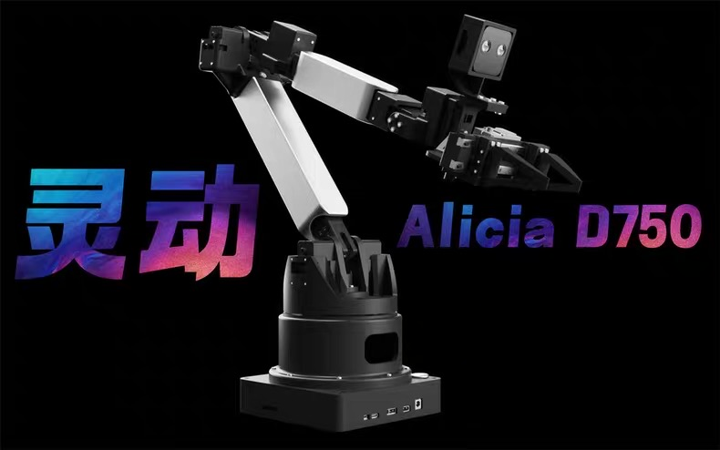

# SparkMind



## Alicia Recorder API 框架

`alicia_recorder` 是一个用于控制和同步 Alicia 机械臂和多个摄像头的 Python API 框架。它被设计为通过多进程架构高效地采集数据，适用于机器人研究和数据收集任务。

## 主要功能

*   **多设备同步**：精确同步来自机械臂和多个摄像头的数据流。
*   **多进程架构**：利用多进程并行处理数据采集和保存，确保高性能和响应速度。
*   **灵活配置**：通过 JSON 配置文件轻松配置机械臂参数（如端口、波特率）和摄像头参数（如 ID、名称、分辨率、帧率）。
*   **数据保存**：能够将采集到的数据（图像和机械臂状态）保存到结构化的目录中，方便后续分析。
*   **易于使用的 API**：提供简洁的 API 接口，用于初始化系统、捕获数据、控制数据保存以及清理资源。

## 如何使用

### 1. 安装依赖

首先，请确保您已经安装了所有必要的依赖项。这些依赖项通常在 `requirements.txt` 文件中列出。您可以使用 pip 来安装它们：

```bash
pip install -r requirements.txt
```

### 2. 配置硬件

编辑配置文件 `config/api_test_config.json` 以匹配您的硬件设置。

一个典型的配置示例如下：

```json
{
    "camera": {
        "ids": [0, 2], // 您的摄像头设备 ID
        "names": ["main_camera", "secondary_camera"], // 为您的摄像头命名
        "width": 640,
        "height": 480,
        "fps": 30
    },
    "arm": {
        "name": "robot_arm", // 您的机械臂名称
        "port": "/dev/ttyUSB0", // 机械臂连接的串口
        "baudrate": 921600, // 机械臂通信波特率
        "debug_mode": false
    },
    "dataset": {
        "name": "my_dataset" // 数据集保存时的名称
    }
}
```

**重要**:
*   请根据您的实际摄像头 ID 修改 `"ids"` 列表。
*   请根据您的机械臂实际连接的串口修改 `"port"`。
*   `"names"` 列表中的摄像头名称应与 `"ids"` 一一对应。

### 3. 基本 API 使用示例

以下是一个简单的 Python 脚本，演示了如何使用 `alicia_recorder` API 的核心功能：

```python
from alicia_recorder.api import initialize, capture_data, cleanup, create_dataset_directories, save_data, stop_save_data
import time
import cv2 # 如果需要显示图像

# 配置文件路径
config_path = "config/api_test_config.json" # 确保路径正确

def main():
    # 1. 初始化 API
    print("正在初始化 API...")
    success, config = initialize(config_path, mode="record") # "record" 模式用于数据采集和保存
    if not success:
        print("API 初始化失败。")
        return
    print("API 初始化成功。")
    print(f"加载的配置: {config}")

    is_saving = False

    try:
        # 2. 循环捕获数据
        print("开始捕获数据... 按 'q' 退出, 's' 开始/停止保存。")
        
        # 如果需要显示图像，为每个摄像头创建一个窗口
        # for cam_name in config["camera"]["names"]:
        #     cv2.namedWindow(f"cap: {cam_name}", cv2.WINDOW_NORMAL)

        while True:
            data = capture_data()
            if data:
                # 处理捕获到的数据
                # print(f"捕获到数据: {data['timestamp']}")
                
                # 显示图像 (可选)
                # images_data = data.get('images_data', {})
                # for name, image_info in images_data.items():
                #     image = image_info.get('image')
                #     if image is not None:
                #         cv2.imshow(f"cap: {name}", image)
                pass # 替换为您的数据处理逻辑

            # 模拟按键控制 (在实际应用中，您可能需要一个更健壮的按键检测方法)
            key = cv2.waitKey(1) & 0xFF # 确保至少有一个cv2窗口时此方法才有效
            if key == ord('q'):
                print("请求退出...")
                break
            elif key == ord('s'):
                if not is_saving:
                    dataset_root = create_dataset_directories(config)
                    if dataset_root:
                        print(f"开始保存数据到: {dataset_root}")
                        save_data(dataset_root)
                        is_saving = True
                    else:
                        print("创建数据集目录失败，无法开始保存。")
                else:
                    print("停止保存数据。")
                    stop_save_data()
                    is_saving = False
            
            time.sleep(0.01) # 稍微等待，避免CPU占用过高

    except Exception as e:
        print(f"发生错误: {e}")
    finally:
        # 4. 清理资源
        print("正在清理资源...")
        cleanup()
        # cv2.destroyAllWindows() # 如果使用了cv2窗口
        print("清理完成。")

if __name__ == "__main__":
    main()
```

## API 详细参考

以下是 `alicia_recorder.api` 模块中主要函数的详细说明：

### 1. `initialize(config_path: str, mode: str = "eval") -> Tuple[bool, Optional[Dict]]`

*   **功能**: 初始化数据采集系统。这包括加载配置文件，设置日志记录器，并启动底层的 `ProcessManager` 来管理机械臂和摄像头的进程。
*   **输入参数**:
    *   `config_path (str)`: 指向 JSON 配置文件的路径。此文件包含摄像头、机械臂和数据集的设置。
    *   `mode (str, 可选)`: 操作模式。可以是:
        *   `"record"`: 用于数据采集和保存。在此模式下，数据保存相关的进程会被初始化。
        *   `"eval"` (默认): 用于评估或实时查看，不进行数据保存。
*   **返回值**: `Tuple[bool, Optional[Dict]]`
    *   一个元组，第一个元素是布尔值，表示初始化是否成功 (`True` 表示成功, `False` 表示失败)。
    *   第二个元素是加载的配置字典 (`Dict`)，如果初始化成功；否则为 `None`。
*   **示例**:
    ```python
    from alicia_recorder.api import initialize
    
    config_file = "config/api_test_config.json"
    success, loaded_config = initialize(config_file, mode="record")
    
    if success:
        print("API 初始化成功!")
        print(f"加载的配置: {loaded_config}")
    else:
        print("API 初始化失败。")
    ```

### 2. `create_dataset_directories(config: Dict, base_dataset_dir: str = "data/", dataset_name_prefix: str = "dataset") -> Optional[str]`

*   **功能**: 根据提供的配置，在指定的基础目录下创建一个新的、版本化的数据集目录结构。它会自动创建 `epochN` 格式的子目录，以避免覆盖现有数据。还会为机械臂数据和每个摄像头数据创建相应的子目录。
*   **输入参数**:
    *   `config (Dict)`: 从 `initialize` 函数获取的配置字典。需要包含 `arm.name` 和 `camera.names` 来创建相应的子目录。
    *   `base_dataset_dir (str, 可选)`: 数据集的主存储目录。默认为 `"data/"`。
    *   `dataset_name_prefix (str, 可选)`: 数据集名称的前缀，通常从配置文件的 `dataset.name` 获取。默认为 `"dataset"`。
*   **返回值**: `Optional[str]`
    *   如果成功创建目录，则返回新创建的 `epochN` 目录的绝对路径 (字符串)。
    *   如果创建失败（例如，配置缺失或权限问题），则返回 `None`。
*   **示例**:
    ```python
    from alicia_recorder.api import initialize, create_dataset_directories
    
    success, config = initialize("config/api_test_config.json")
    if success:
        # 假设 config 中定义了 dataset: {"name": "my_robot_data"}
        # arm: {"name": "ur5"}
        # camera: {"names": ["cam1", "cam2"]}
        dataset_epoch_path = create_dataset_directories(config)
        if dataset_epoch_path:
            print(f"数据集目录已创建: {dataset_epoch_path}")
            # 路径可能类似于: /path/to/project/data/my_robot_data/epoch0
            # 并且包含子目录:
            # .../epoch0/ur5/
            # .../epoch0/camera/cam1/
            # .../epoch0/camera/cam2/
        else:
            print("创建数据集目录失败。")
    ```

### 3. `capture_data(timeout: float = 1.0) -> Optional[Dict[str, Any]]`

*   **功能**: 从 `ProcessManager` 获取一个同步的数据包。这个数据包包含了来自所有活动摄像头和机械臂的最新数据，并带有时间戳。
*   **输入参数**:
    *   `timeout (float, 可选)`: 等待新数据到达的超时时间（秒）。默认为 `1.0` 秒。
*   **返回值**: `Optional[Dict[str, Any]]`
    *   如果成功获取数据，则返回一个包含同步数据的字典。
    *   如果超时或发生错误，则返回 `None`。
    *   **数据字典结构示例**:
        ```json
        {
            "timestamp": 1678886400.123456, // 主同步时间戳 (通常是平均时间或特定源的时间)
            "arm_data": {
                "joint_state": [0.1, 0.2, 0.3, 0.4, 0.5, 0.6, 0.0], // 关节角度和夹爪状态
                // ... 其他机械臂相关数据
            },
            "arm_timestamp": 1678886400.123000, // 机械臂数据的时间戳
            "images_data": {
                "main_camera": {
                    "image": "<numpy.ndarray>", // OpenCV BGR 图像 (NumPy 数组)
                    "timestamp": 1678886400.120000 // 该图像的时间戳
                },
                "secondary_camera": {
                    "image": "<numpy.ndarray>",
                    "timestamp": 1678886400.125000
                }
            },
            "time_diff": { // (可选) 时间同步差异信息
                 "main_camera_to_avg": 0.003456, // main_camera 时间戳与平均时间戳的差异
                 "arm_to_avg": -0.000456       // arm 时间戳与平均时间戳的差异
            }
            // ... 其他可能的同步元数据
        }
        ```
*   **示例**:
    ```python
    from alicia_recorder.api import capture_data
    import cv2
    
    # (假设 API 已经初始化)
    data_packet = capture_data(timeout=0.5)
    
    if data_packet:
        print(f"捕获到数据，主时间戳: {data_packet['timestamp']}")
        if 'arm_data' in data_packet and data_packet['arm_data']:
            print(f"机械臂关节: {data_packet['arm_data']['joint_state']}")
        
        for cam_name, img_data in data_packet.get('images_data', {}).items():
            image = img_data.get('image')
            if image is not None:
                # cv2.imshow(cam_name, image) # 显示图像
                print(f"摄像头 {cam_name} 捕获到图像，时间戳: {img_data['timestamp']}")
    else:
        print("未捕获到数据或超时。")
    ```

### 4. `save_data(save_path: str)`

*   **功能**: 指示 `ProcessManager` 开始将通过 `capture_data()` 获取的数据包保存到指定的目录。此函数通常在 `create_dataset_directories()` 之后调用，使用其返回的路径。
*   **输入参数**:
    *   `save_path (str)`: 数据保存的根目录路径 (通常是 `epochN` 目录)。数据将在此路径下按设备名称（机械臂、摄像头）组织保存。
*   **返回值**: 无。
*   **示例**:
    ```python
    from alicia_recorder.api import create_dataset_directories, save_data, initialize
    
    success, config = initialize("config/api_test_config.json", mode="record")
    if success:
        dataset_path = create_dataset_directories(config)
        if dataset_path:
            save_data(dataset_path)
            print(f"数据将开始保存到: {dataset_path}")
        else:
            print("无法创建数据集目录，因此无法开始保存。")
    ```

### 5. `stop_save_data()`

*   **功能**: 指示 `ProcessManager` 停止保存数据。之前通过 `save_data()` 启动的数据保存队列将被清空并停止接受新数据。
*   **输入参数**: 无。
*   **返回值**: 无。
*   **示例**:
    ```python
    from alicia_recorder.api import stop_save_data
    
    # (假设数据正在保存中)
    stop_save_data()
    print("数据保存已停止。")
    ```

### 6. `cleanup()`

*   **功能**: 清理所有 API 相关的资源。这包括停止所有由 `ProcessManager` 管理的子进程（摄像头、机械臂、数据保存等），关闭队列和事件，并重置全局状态。在程序结束前调用此函数非常重要，以确保所有进程都已正确终止。
*   **输入参数**: 无。
*   **返回值**: 无。
*   **示例**:
    ```python
    from alicia_recorder.api import initialize, cleanup
    
    initialize("config/api_test_config.json")
    # ... 执行数据采集和其他操作 ...
    
    print("正在清理资源...")
    cleanup()
    print("清理完成。")
    ```

## `test.py` 脚本介绍

项目根目录下的 `test.py` 脚本是一个用于测试 `alicia_recorder` API 各项核心功能的示例程序。它可以帮助您快速验证 API 是否按预期工作，并展示了 API 的基本用法。

### `test.py` 的主要功能：

1.  **加载配置**：从 `config/api_test_config.json` 加载配置。如果配置文件不存在，它会尝试创建一个示例配置文件，您需要根据实际情况修改后再运行。
2.  **初始化 API**：调用 `initialize()` 函数来启动数据采集进程。
3.  **捕获数据**：在一个循环中调用 `capture_data()` 来获取同步的机械臂和摄像头数据。
4.  **显示数据（部分注释掉）**：脚本中包含显示时间戳、机械臂关节角度和摄像头图像的代码（部分被注释掉了）。您可以取消注释以实时查看数据。
5.  **控制数据保存**：
    *   按 `s` 键：调用 `create_dataset_directories()` 创建数据集目录，并调用 `save_data()` 开始将捕获的数据保存到该目录。
    *   按 `z` 键：调用 `stop_save_data()` 停止保存数据。
6.  **退出和清理**：按 `q` 键退出数据捕获循环，并调用 `cleanup()` 来释放所有资源。
7.  **图像显示**：使用 OpenCV (`cv2`) 来显示摄像头捕获的图像，并在图像上叠加时间戳和摄像头名称等信息。

### 如何运行 `test.py`：

1.  确保您已按照上述步骤**安装了依赖**并正确**配置了 `config/api_test_config.json`**。
2.  打开终端，导航到项目的根目录 (`/home/ubuntu/Github/alicia_recorder/`)。
3.  运行脚本：

    ```bash
    python test.py
    ```

运行后，您应该能看到来自 API 的日志信息，如果取消了图像显示代码的注释并且摄像头正常工作，您还会看到摄像头图像窗口。您可以按照提示按键来测试数据保存等功能。

## 数据可视化和导出

*   `display.py`: 提供了一个GUI工具，用于可视化已保存的数据集中的图像和关节数据。
    ```bash
    python display.py -d data/my_dataset/epoch0 
    ```
    (请将 `data/my_dataset/epoch0` 替换为您的实际数据集路径)

*   `display_save_video.py`: 将保存的数据集直接转换为视频文件，不显示GUI。
    ```bash
    python display_save_video.py -d data/my_dataset/epoch0 -o output_video.mp4
    ```
    (请将 `data/my_dataset/epoch0` 替换为您的实际数据集路径，并将 `output_video.mp4` 替换为您想要的输出文件名)

## 注意事项

*   确保您的机械臂和摄像头已正确连接并且驱动程序已安装。
*   根据您的操作系统和硬件，串口名称 (`/dev/ttyUSB0`) 和摄像头 ID (`[0, 2]`) 可能会有所不同。
*   日志文件会保存在 `alicia_recorder/logs/` 目录下。
